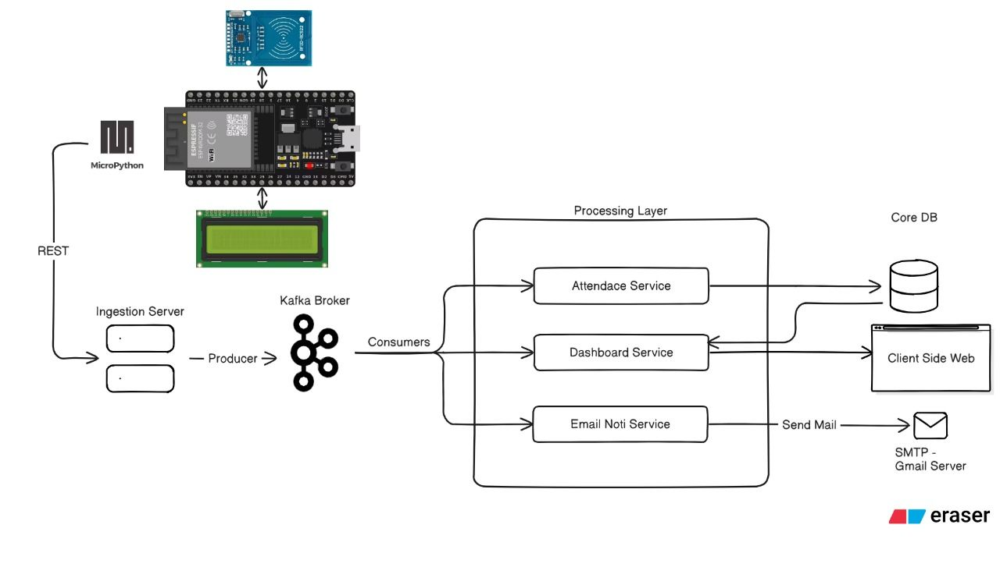
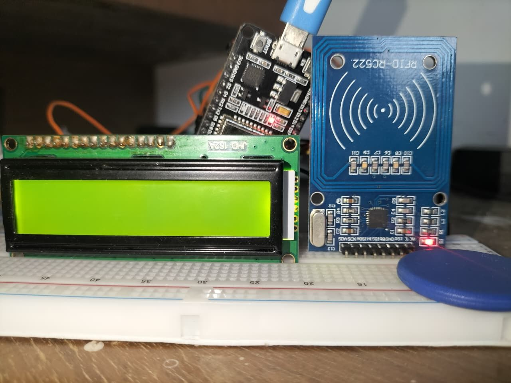
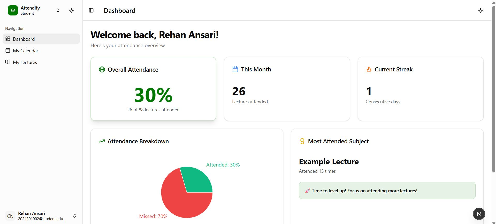

# 🚀 IoT-Based Attendance System

A scalable IoT attendance system built with ESP32, RFID technology, and microservices architecture for real-time attendance tracking and management.

## 📋 Overview

This project demonstrates a complete end-to-end **IoT attendance system** that integrates **RFID, LCD, and ESP32 (MicroPython)** with a **microservices-driven backend architecture**. The system provides real-time attendance tracking, instant notifications, and a comprehensive dashboard for monitoring.

## 🎯 System Architecture



The system follows an **event-driven, fault-tolerant, and scalable pipeline** design:

### How It Works:
1. 🔹 **RFID Card Scanning**: When an RFID card is scanned, the ESP32 captures the card data and displays feedback on the LCD
2. 🔹 **API Integration**: The ESP32 pushes data via **RESTful APIs** to an **ingestion server**
3. 🔹 **Event Streaming**: The server publishes data into **Apache Kafka**, acting as the event broker
4. 🔹 **Microservices Processing**: Three specialized microservices handle the data:
   - **Attendance Service** — Updates and stores attendance records
   - **Dashboard Service** — Pushes real-time updates to user dashboards
   - **Email Service** — Sends instant attendance confirmations through Gmail integration
5. 🔹 **Database Design**: Uses a **write-heavy core database** for updates and a **read-heavy replica** for fast dashboard queries

## 🛠️ Technology Stack

### IoT Hardware
- **ESP32** (MicroPython)
- **RFID Module** (MFRC522)
- **LCD Display** (16x2)
- **Jumper Wires & Breadboard**

### Backend Services
- **Apache Kafka** - Event streaming and message broker
- **RESTful APIs** - Communication layer
- **Microservices Architecture**
- **Database** - Write-heavy core + Read-heavy replica design
- **Gmail Integration** - Email notifications

### Frontend
- **Dashboard Interface** - Real-time attendance monitoring
- **Landing Page** - System information and access

## 📸 Project Showcase

### Hardware Setup

*Complete hardware setup showing ESP32, RFID module, LCD display, and all connections*

### System Interface

#### Landing Page

*Clean and intuitive landing page interface*

#### Real-time Dashboard

*Comprehensive dashboard showing real-time attendance data and analytics*

#### Email Notifications

*Automatic email acknowledgments sent to students upon attendance marking*

## ⚡ Key Features

- **Ultra-low Latency**: Optimized RFID module for instant card detection
- **Real-time Updates**: Live dashboard updates through event streaming
- **Instant Notifications**: Immediate email confirmations via Gmail integration
- **Scalable Architecture**: Microservices design for easy scaling and maintenance
- **Fault Tolerance**: Robust error handling and system reliability
- **Event-driven Design**: Kafka-based event streaming for efficient data flow

## 🚀 Getting Started

### Prerequisites
- ESP32 board
- RFID-RC522 module
- 16x2 LCD display
- Python environment with MicroPython support
- Apache Kafka setup
- Email service configuration

### Hardware Connections
Refer to `esp32_gpio_lcd.py` and `main.py` for detailed GPIO pin configurations and wiring setup.

### Software Setup
1. Flash MicroPython to your ESP32
2. Upload the main scripts (`main.py`, `mfrc522.py`, `ldc_api.py`)
3. Configure your backend services
4. Set up Kafka broker
5. Deploy microservices

## 📁 Project Structure

```
├── main.py                           # Main ESP32 application
├── mfrc522.py                        # RFID module driver
├── ldc_api.py                        # LCD display handler
├── esp32_gpio_lcd.py                 # GPIO and LCD configuration
├── esp-front/                        # Frontend application
├── architecture.png                  # System architecture diagram
├── dashboard.png                     # Dashboard screenshot
├── landingPageUrl.png               # Landing page screenshot
├── hardwarePhoto.png                # Hardware setup photo
├── emailss.png                      # Email notification screenshot
└── README.md                        # Project documentation
```

## 🔧 Configuration

The system requires configuration for:
- WiFi credentials in ESP32
- API endpoints for data ingestion
- Kafka broker settings
- Email service credentials
- Database connection parameters

## 📈 System Performance

- **Low Latency**: Optimized for ultra-fast RFID detection
- **High Availability**: Fault-tolerant microservices design
- **Scalable**: Event-driven architecture supports growing user base
- **Real-time**: Instant updates across all system components

## 🤝 Contributing

Feel free to contribute to this project by:
- Reporting bugs
- Suggesting new features
- Improving documentation
- Submitting pull requests

## 📄 License

This project is open source and available under the [MIT License](LICENSE).

## 🏷️ Tags

`#IoT` `#ESP32` `#MicroPython` `#Kafka` `#SystemDesign` `#Microservices` `#FullStack` `#RFID` `#EventDrivenArchitecture` `#CloudComputing` `#EdgeToCloud`

---

**Built with ❤️ for scalable IoT solutions**

*This project showcases the integration of embedded programming with robust cloud infrastructure, demonstrating expertise in IoT systems, event streaming, distributed database design, and full-stack microservices architecture.*